# DoVs-Project
# 🎨 Interactive Image Transformation App

## Project Overview
This project is an interactive image transformation tool developed entirely in **Google Colab** using **ipywidgets**, **OpenCV**, and **scikit-learn**. It enables users to apply eight artistic filters to any image, transforming them into stylized artworks.

Please Click on the link to interact with the app. [Open in Google Colab](https://colab.research.google.com/your-notebook-link)

### Supported Filters
- Impressionism  
- Watercolour Painting  
- Charcoal Sketch  
- Comic Book  
- Oil Canvas  
- Word Art  
- Pointillism  
- Andy Warhol Style  

Users can either upload their own images or select from built-in examples. The platform is optimized for real-time use, with an intuitive UI. It requires no installation beyond fetching default assets via `gdown`, making it highly portable and user-friendly.

The interface dynamically adapts to the selected filter, showing relevant inputs only when needed (e.g., the text box appears only for Word Art). It also includes real-time feedback labels to inform users when processing is underway, helping prevent accidental interruptions. Once a filter is applied, the original and stylized images are displayed side-by-side for comparison. A dedicated download button lets users save their results instantly.

---

## How to Run
1. Open the Colab notebook [Insert Your Colab Link Here].
2. Run all cells (**Runtime > Run all**).
3. Choose an image (upload or default).
4. Select a filter from the dropdown.
5. For **Word Art**, type a word/phrase in the input field.
6. Click **“Run Filter”** to apply the effect.
7. Download the result using the provided button.

**Note**: The **Word Art** filter takes 2–3 minutes. Avoid interacting with the UI during processing.

---

##  Filter Reports

### Impressionism
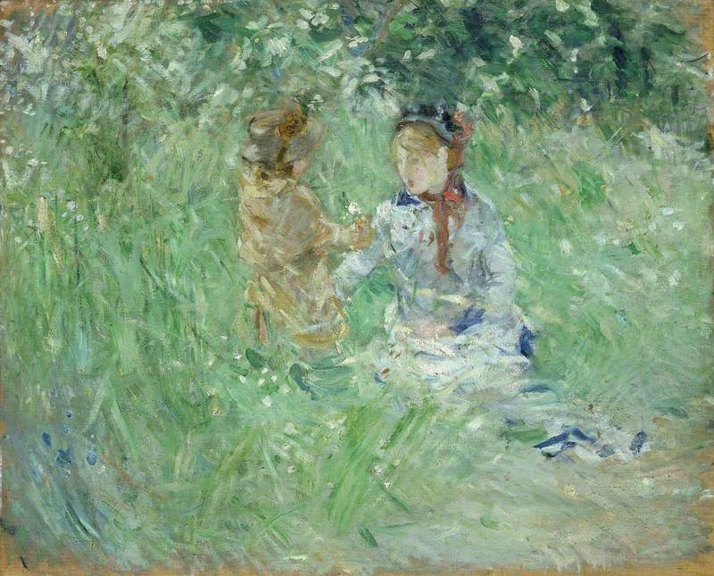

**Implementation:**  
The Impressionism filter captures the loose, textured feel of impressionist paintings by layering randomized brush strokes over a simplified color base. The image is resized to 300×300 for performance efficiency, and KMeans clustering reduces the color palette to 16 dominant tones, imitating the restricted color choices typical in impressionist artwork. A soft Gaussian blur of the original image is used as the background to preserve structure. Then, simulated strokes are drawn using the quantized colors, with each line given a randomized angle and position jitter to evoke the expressive, human quality of hand-painted art. These strokes vary in direction and overlap, building a layered, painterly texture that preserves the image’s overall form while abstracting fine detail.

**Development Iterations:**  
Initial attempts used a white canvas, which introduced patchy gaps. Switching to a blurred base image added visual continuity. Parameters like stroke spacing, angle, and blending ratio were adjusted to achieve a balance between abstraction and recognizability.

**Evaluation:**  
It excels with portraits and landscapes but underperforms in crowded or distant group photos where finer details get lost.

**Future Improvements:**  
Incorporating adaptive stroke thickness, variable stroke length based on texture, and gradient-based orientation could enhance realism. These additions would mimic traditional brushwork more faithfully.

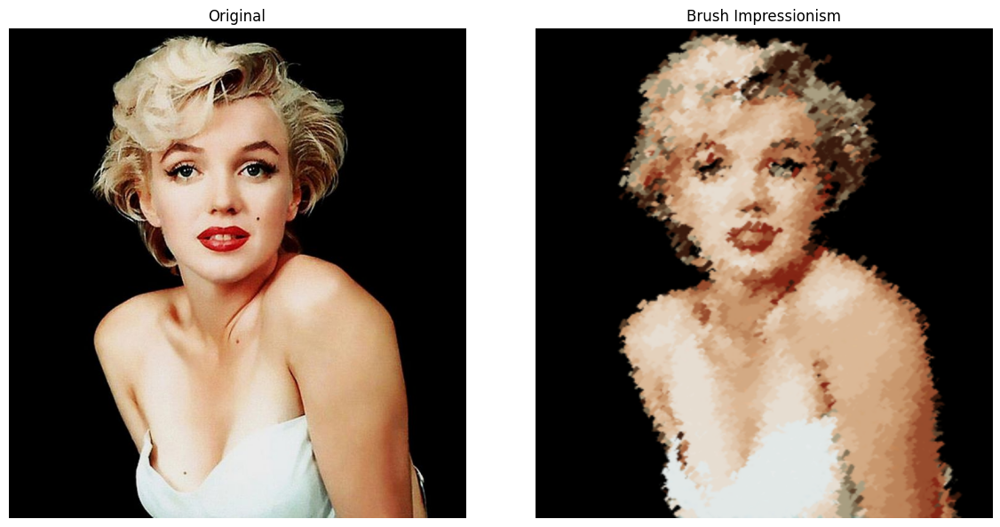

---

### Watercolour Painting
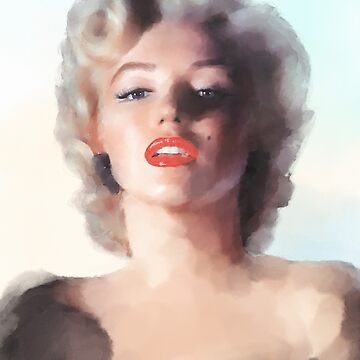

**Implementation:**  
The Watercolour filter simulates the soft blending and delicate transitions characteristic of watercolor paintings. It begins with a bilateral filter that smooths regions while maintaining edge integrity, creating a base that mimics pigment diffusion on paper. Next, edges are extracted from a grayscale version of the smoothed image using Canny edge detection, slightly thickened via dilation, and then inverted to blend softly with the base layer. This edge blend preserves structure without introducing harsh outlines. To protect natural highlights, a luminance mask is generated from the blended result, ensuring that very bright areas are not dulled during tone adjustments. The final steps involve warming the color tone slightly and applying desaturation in the HSV color space, which collectively give the image its pastel, paper-washed appearance.

**Development Iterations:**  
Initially, the lack of edges made images appear overly blurry. Adding Canny edge detection brought structure back. Brightness masking preserved highlights and avoided flattening. Fine-tuning of bilateral strength, thresholds, and color tone yielded a soft but expressive look.

**Evaluation:**  
Strong lighting and clear edges give the best results. Low-contrast or underexposed images lose definition after desaturation.

**Future Improvements:**  
Adaptive thresholding for highlight masking, watercolor-bleed textures, and region-specific saturation control could yield better results.

---

### Charcoal Sketch
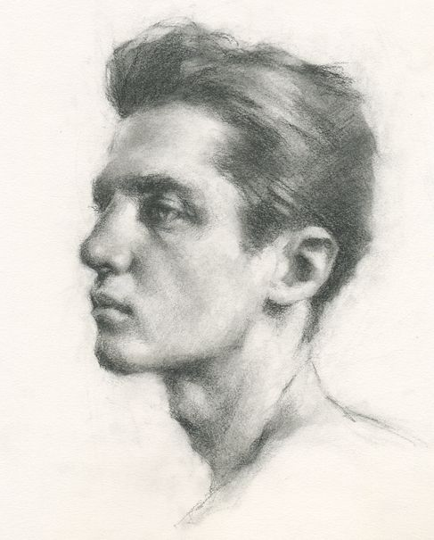

**Implementation:**  
The Charcoal Sketch filter recreates the aesthetic of hand-drawn charcoal artwork using a grayscale-focused approach. The image is first converted to grayscale, then inverted to emphasize the contrast between light and shadow. A Gaussian blur is applied to the inverted image to mimic the smudging effect seen in real charcoal sketches. This blurred image is then blended with the original grayscale using equal weighting, producing smooth transitions while preserving important contours. The result is converted back to a 3-channel BGR format to ensure compatibility with color-based processing pipelines. This minimalist approach effectively balances softness and structure, creating a believable charcoal rendering without explicit edge detection.

**Development Iterations:**  
Earlier versions used dodge blending and Laplacian subtraction, but this caused white halos—especially around subjects with black backgrounds (e.g., Marilyn Monroe). Replacing that with grayscale inversion and Gaussian blending resolved the artifact issue.

**Evaluation:**  
Works well on close-up portraits with strong contrast. Cluttered or dark backgrounds can reduce clarity.

**Future Improvements:**  
Adaptive blur based on detail, paper texture overlays, and content-aware enhancement (portrait vs. scenery) could improve balance and realism.

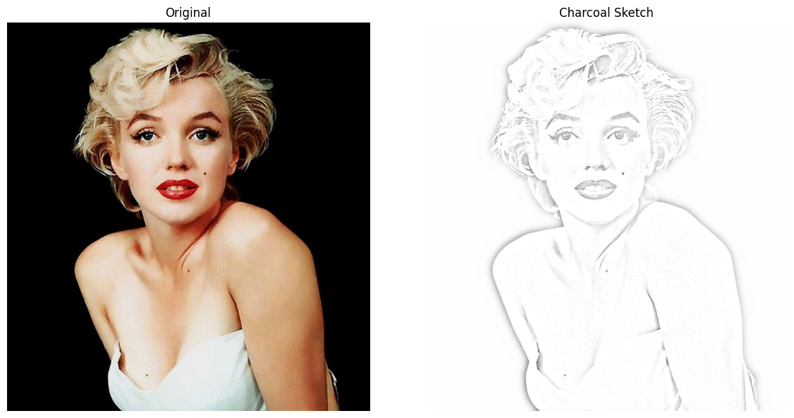

---

### Comic Book
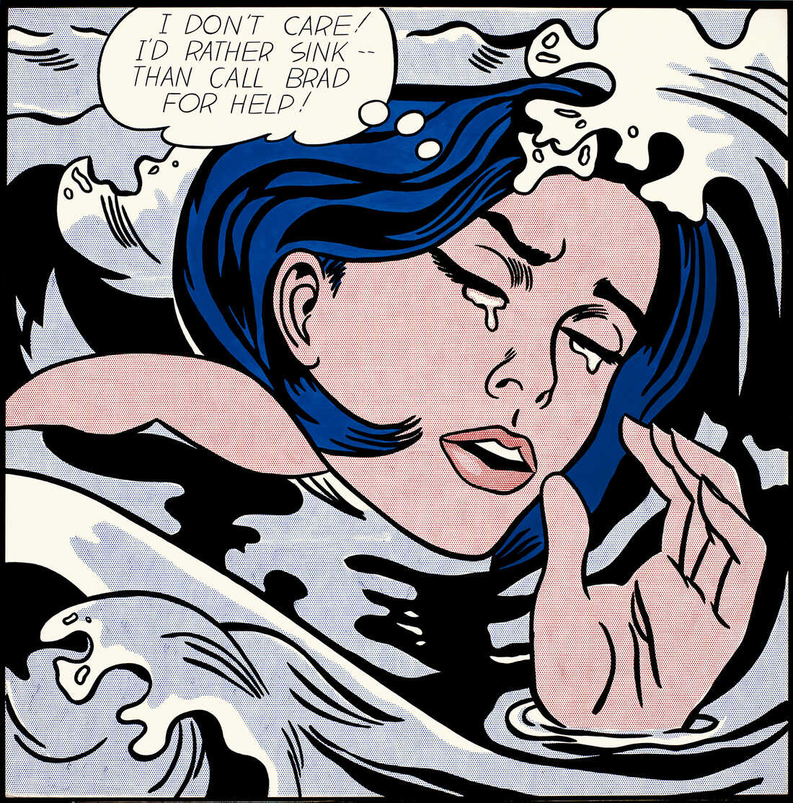

**Implementation:**  
The Impressionism filter captures the loose, textured feel of impressionist paintings by layering randomized brush strokes over a simplified color base. The image is resized to 300×300 for performance efficiency, and KMeans clustering reduces the color palette to 16 dominant tones, imitating the restricted color choices typical in impressionist artwork. A soft Gaussian blur of the original image is used as the background to preserve structure. Then, simulated strokes are drawn using the quantized colors, with each line given a randomized angle and position jitter to evoke the expressive, human quality of hand-painted art. These strokes vary in direction and overlap, building a layered, painterly texture that preserves the image’s overall form while abstracting fine detail.

**Development Iterations:**  
Initial Mean Shift clustering was accurate but slow. KMeans offered better performance. Sobel edges were too thick, so Canny was adopted. Morphological closing was tested but led to overconnected edges. Halftone blending and radius tweaking refined the final look.

**Evaluation:**  
Ideal for well-lit, cleanly composed portraits. Less effective for low-contrast or evenly lit images, where outlines become faint and impact is reduced.

**Future Improvements:**  
Mean Shift clustering could improve segmentation in complex scenes, and advanced edge detectors may offer better consistency across varied lighting.

---

### Oil Canvas
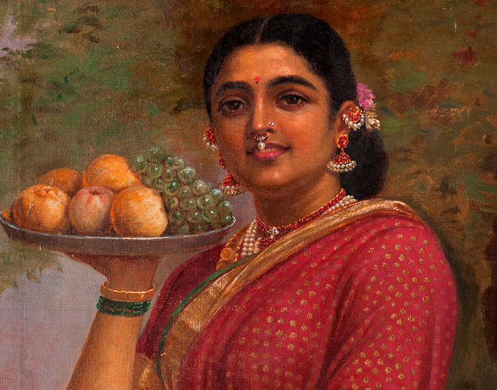

**Implementation:**  
The Oil on Canvas filter mimics the layered texture and rich tones of oil painting. It begins by normalizing the image and applying a bilateral filter per channel to smooth color gradients while preserving edges—similar to brush blending. KMeans clustering is used to extract 16 dominant colors, giving the image a stylized, painterly flatness. The original image is converted to grayscale and passed through a Sobel filter to detect edges, which are then inverted and scaled down to create a mask. This mask is used to suppress high-gradient regions in the final composition. Finally, the quantized and smoothed outputs are blended (70% smoothed, 30% quantized) and multiplied by the edge mask, producing a soft, layered effect that emulates brush buildup over textured surfaces.

**Development Iterations:**  
Initial versions used Canny edges and binary masks, which led to sharp, unnatural overlays. Switching to Sobel and using inverted gradients for suppression softened transitions and improved texture blending.

**Evaluation:**  
Performs best on portraits or compositions with strong lighting and color contrast. Struggles with busy scenes or low-contrast images due to excessive flattening.

**Future Improvements:**  
Edge-aware smoothing and region-adaptive clustering could retain more detail in complex zones. Adding brush textures would also enhance authenticity.

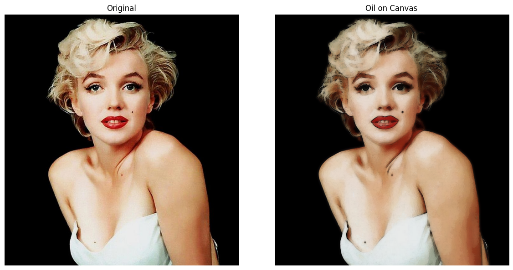

---

### Word Art
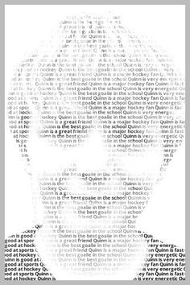

**Implementation:**  
The Word Art filter transforms an image into typographic artwork by replacing pixels with words whose sizes are dynamically mapped to local brightness. The input image is first validated and converted to grayscale to extract luminance. It is then resized for better performance and readability. A large white canvas is created, and the user’s input phrase is split into words. These words are sequentially drawn across the canvas, mapped to every alternate pixel. Font sizes are determined using an interpolation function, where darker pixels yield larger fonts. The result is a text-based rendering that visually represents tonal gradients using size and spacing, forming an image entirely from words.

**Development Iterations:**  
Early versions used single characters and lacked coherence. Switching to full phrases improved narrative and aesthetic impact. Font size scaling and spacing were refined to maintain balance. Faint backgrounds were avoided as they muddled contrast.

**Evaluation:**  
Performs well on portraits or icons with strong shapes. Struggles on busy or low-contrast scenes. Long phrases lead to layout clutter and repetition artifacts.

**Future Improvements:**  
Support for boldness simulation and smarter text wrapping would improve flexibility. Limiting phrase length or auto-summarizing content could help maintain clarity in dense regions.

---

### Pointillism
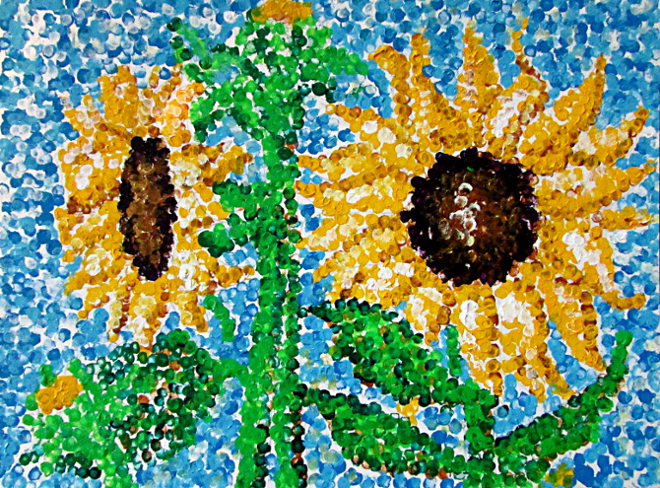

**Implementation:**  
The Comic Book filter combines bold lines, flat colors, and halftone texture to emulate classic comic illustrations. First, KMeans clustering reduces the color complexity to six key tones, and this simplified version is blended with the original image to retain texture. Canny edge detection identifies prominent contours, which are inverted and overlaid on the blended image to simulate comic ink outlines. To add a print-like texture, a halftone layer is generated: the image is scanned in a grid, and circular dots are drawn at regular intervals with sizes based on pixel brightness. These black dots are softly blended over the image, contributing to the overall comic style without overwhelming the content.

**Development Iterations:**  
Early versions had tiny, densely packed dots, making images noisy and hard to interpret. Increasing dot spacing and radius improved legibility. A faint background image was also tried, but it muddied the colors. White background was reinstated for contrast.

**Evaluation:**  
Great for colorful or high-contrast images. Loses detail in portraits or low-contrast scenes where dot patterns can't capture nuance.

**Future Improvements:**  
Adaptive dot sizing—small in detailed areas, large in flat regions—could enhance image fidelity while preserving the stylized effect.

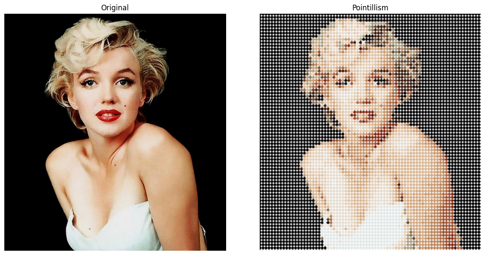

---

### Andy Warhol Style
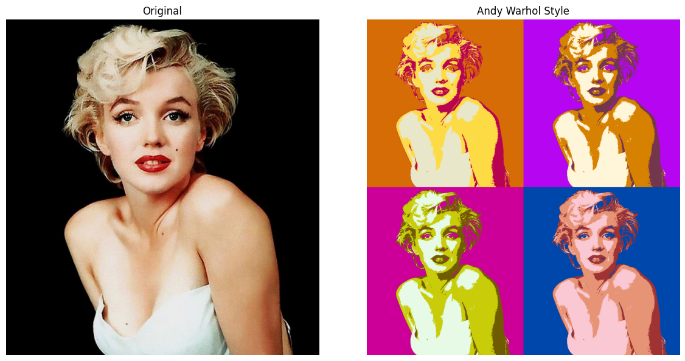

**Implementation:**  
The Andy Warhol filter recreates the bold, high-contrast repetition and color blocking of Warhol’s pop art. KMeans clustering reduces the image to four major colors, which are then mapped to predefined pop color schemes. Four different recolored versions are generated using unique Warhol-style palettes. Each pixel is matched to its color cluster and recolored according to the selected scheme. Finally, the four recolored images are arranged in a 2x2 collage, forming a striking visual composition. This repetition of subject with varying color schemes reflects the graphic, screen-printed look Warhol was known for.

**Development Iterations:**  
Mean Shift was tried for better segmentation but was too slow. KMeans offered a good trade-off. Sobel edges were also explored but made the design too noisy, so the filter focused on color blocking only.

**Evaluation:**  
Performs best on single-subject portraits or objects with plain backgrounds. Struggles on landscapes or group images, where clusters get messy and impact is lost.

**Future Improvements:**  
Preprocessing to isolate subjects could improve performance on complex backgrounds. More color map variety or dynamic palette selection could expand creative range.

---
